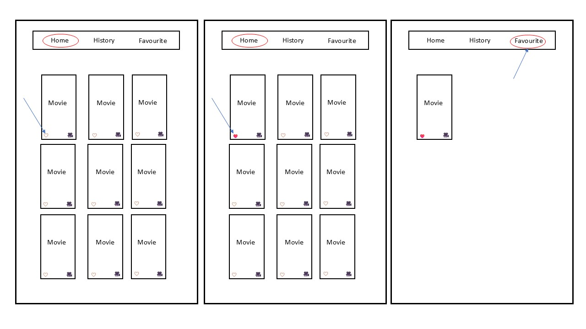
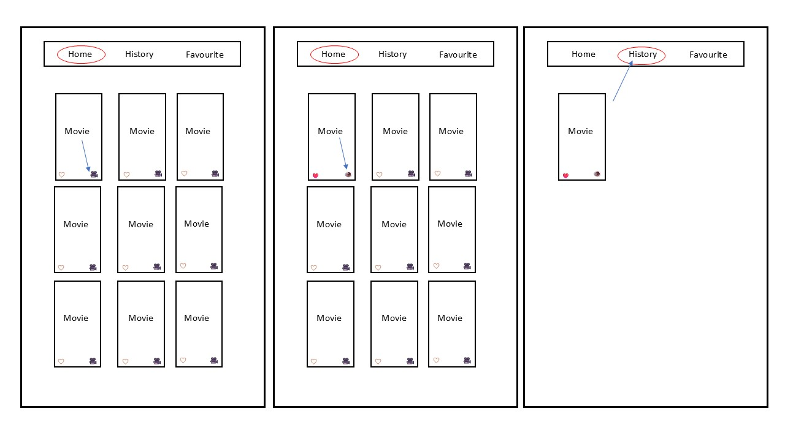

# Porject 2 - Movies App

## **_Description_**

This app allows users to discover popular movies, search by name, view detailed movie information, track their watch history, and save their favorite movies.


## **_Movies Concept_**

The Movie App is built to help users easily find, track, and organize their favorite movies. It aims to make discovering and managing movies simple, fun, and personal.

## **_About The Project_**

In this project, I wanted to create a Movie App using React, React Router, and Airtable.
The app is designed for movie lovers to easily discover, search, and organize their favorite and watched movies.

Users can:

- View a list of popular movies.

- Search movies by name.

- View detailed information like description and rating.

- Save favorite movies and track their watch history.

- See which movies they have already watched or favorited directly on the homepage.

- I also used Airtable to store user favorites and history, making data management simple and efficient.

## **_App Hierarchy_**






## **_Main Technologies_**

- React

- React Router

- TMDB API

- Airtable API

## **_Project Setup_**

- Make sure to install react-router-dom as it is required for routing:

```
npm install react-router-dom
```

- To start the project, run:

```
npm run dev
```

## **_Environment Variables_**

- This project uses environment variables to connect to the Airtable API.
  You need to create a .env file at the root of your project (outside the src folder).

- Add the following to your .env file:

```
VITE_AIRTABLE_API_KEY=patoLwD3xr2yhokXk.e59d215409622b09ba2410195a044bc4663ba4b2e3d6f0412abea0f41c2323e6
```

⚡ Important:

- Replace your_airtable_api_key, your_airtable_base_id, and your_table_name with your actual Airtable credentials.

## **_API_**

This project uses:

- A public movie API to fetch movie data (EX: TMDB API)

- Airtable API to manage favorites and watch history.

## **_Resources & Attribution_**

Here are some of the helpful resources and tutorials I used while building this app:

- **API** : [TMDB API](https://developer.themoviedb.org/reference/intro/getting-started)

- **Stack Overflow** : [Display images from TMDB API](https://stackoverflow.com/questions/67575385/i-am-trying-to-display-images-from-tmdb-api-but-my-code-doesnt-work?newreg=315f199f1eaa461bb802bbe45c5a4ba3)

- **YouTube Tutorials** :

  - [React & Airtable API Integration](https://www.youtube.com/watch?v=PJz1QlpRJeQ)
  - [React Movie App - Full Tutorial](https://www.youtube.com/watch?v=jc9_Bqzy2YQ)
  - [Using Airtable API in Your Project](https://www.youtube.com/watch?v=LMtBR06TpUg)
  - [CSS3 Transitions](https://www.w3schools.com/css/css3_transitions.asp)
  - [Airtable API CRUD Operations](https://www.youtube.com/watch?v=431DUppjdt8)

- **Guides & Articles:** :
  - [How to Create, Update, Retrieve, and Delete records in Airtable (POST, PATCH, GET & DELETE) - Landbot Help](https://help.landbot.io/article/s9r6j4iby4-how-to-create-update-delete-and-retrieve-records-in-airtable-post-patch-delete-get)
  - [How To Use Airtable API - a step-by-step Integration Guide and Full Documentation List - unremot.com](https://unremot.com/blog/how-to-use-airtable-api/)

## **_Planned future enhancements_**

### 1. Movie Reviews and Ratings

- Allow users to write their own movie reviews and rate the movies they’ve watched, which can be viewed on the movie details page.

### 2. Improved UI/UX Design

- Enhance the user interface and experience with animations, transitions, and an overall more modern design.

### 3. Multi-Language Support

- Expand language options to support more languages, allowing international users to access the app in their native language.
