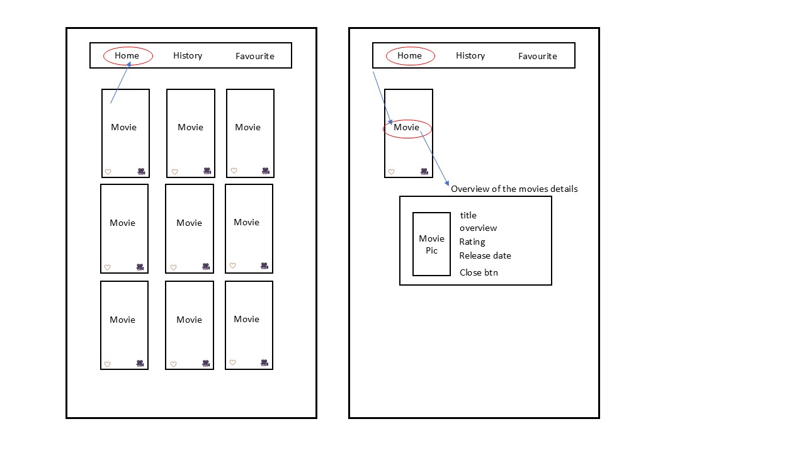

# 🎬Porject 2 - Movies App

## **_Description_**

This app allows users to discover popular movies, view detailed movie information, track their watch history, and save their favorite movies.


## **_Movies Concept_**

This Movie App allows users to:

- Discover popular movies
- View detailed movie information
- Track their **watch history**
- Save their **favorite** movies

Users can easily manage which movies they’ve favorited or watched, all in one place.

## **_About The Project_**

The app is built using:

- **React**
- **React Router**
- **TMDB API** (to fetch movie data)
- **Airtable API** (to store user-selected data: favourites & watch history)

Users can:

- 🔥 View a list of popular movies
- 📖 View detailed movie info (overview, rating, release date, poster)
- 💖 Add/remove movies to **Favourites**
- 🕒 Track movies in **Watch History**
- ✅ See which movies are already saved directly on the homepage

Airtable is used for storing and managing favourites/history, making user data handling simple and efficient.

## **_App Hierarchy_**




## **_Main Technologies_**

- React

- React Router

- TMDB API

- Airtable API

## **_Project Setup_**

- Make sure to install react-router-dom as it is required for routing:

```
npm install react-router-dom
```

- To start the project, run:

```
npm run dev
```

## **_Fetch TMDB API Data_**

### **Step 1: Get TMDB API Data**

1. Sign up on TMDB and get your API Key.

2. Use the following endpoint to get popular movie data:

```
GET https://api.themoviedb.org/3/movie/popular?api_key=YOUR_API_KEY
```

Example response:

```
{
  "page": 1,
  "results": [
    {
      "adult": false,
      "backdrop_path": "/fTrQsdMS2MUw00RnzH0r3JWHhts.jpg",
      "genre_ids": [
        28,
        80,
        53
      ],
      "id": 1197306,
      "original_language": "en",
      "original_title": "A Working Man",
      "overview": "Levon Cade left behind a decorated military career in the black ops to live a simple life working construction. But when his boss's daughter, who is like family to him, is taken by human traffickers, his search to bring her home uncovers a world of corruption far greater than he ever could have imagined.",
      "popularity": 581.2791,
      "poster_path": "/xUkUZ8eOnrOnnJAfusZUqKYZiDu.jpg",
      "release_date": "2025-03-26",
      "title": "A Working Man",
      "video": false,
      "vote_average": 6.437,
      "vote_count": 490
    }
  ]
}
```

3. Test this in Postman by sending a **GET** request to the URL above.

## **_Airtable for Favourites & History_**

Instead of transferring all TMDB data into Airtable, only user actions (Add to Favourites / Add to History) are sent to Airtable via API calls.

### **Airtable Table Structure:**

Table 1: Favourites

Table 2: History

Each table includes:

- Title (Single line text)

- Overview (Long text)

- Release Date (Date)

- Poster URL (URL)

### **Add Movie to Airtable Example**

```
const baseId = "Airtable base ID;
const tableName = "Airtable table name";
const apiKey = "Your Airtable API key";
const favouritesUrl = `https://api.airtable.com/v0/${baseId}/${tableName}`;

const postMovieToAirtable = async (movie) => {
  try {
    const postResponse = await fetch(favouritesUrl, {
      method: "POST",
      headers: {
        Authorization: `Bearer ${apiKey}`,
        "Content-Type": "application/json",
      },
      body: JSON.stringify({
        records: [
          {
            fields: {
              id: movie.id,
              title: movie.title,
              overview: movie.overview,
              poster_path: movie.poster_path,
              release_date: movie.release_date,
              vote_average: movie.vote_average,
            },
          },
        ],
      }),
    });

    if (postResponse.ok) {
      const newFavourite = await postResponse.json();
      setFavourites([...favourites, ...newFavourite.records]);
      console.log("Added to favourites!");
    }
  } catch (error) {
    console.error("Error adding to favourites:", error);
  }
};

```

## **Test Airtable API with Postman**

1. Get your Airtable API link from the Airtable API Docs.

2. In Postman, send a GET request to your Airtable API endpoint to retrieve the movie data:

```
GET `https://api.airtable.com/v0/${baseId}/${tableName}`
```

3. Check the response to see if the data was successfully transferred.

## **_Environment Variables_**

- This project uses environment variables to connect to the TMDB & Airtable API.
  You need to create a .env file at the root of your project (outside the src folder).

- Add the following to your .env file:

```
VITE_TMDB_API_KEY=your_TMDB_api_key

VITE_AIRTABLE_API_KEY=your_airtable_api_key
```

⚡ Important:

- Replace your_TMDB_api_key, your_airtable_api_key, your_airtable_base_id, and your_table_name with your actual credentials.

## **_API Used_**

- TMDb API — For movie data

- Airtable API — For saving Favourites & History

## **_Resources & Attribution_**

Here are some of the helpful resources and tutorials I used while building this app:

- **API** : [TMDB API](https://developer.themoviedb.org/reference/intro/getting-started)

- **Stack Overflow** : [Display images from TMDB API](https://stackoverflow.com/questions/67575385/i-am-trying-to-display-images-from-tmdb-api-but-my-code-doesnt-work?newreg=315f199f1eaa461bb802bbe45c5a4ba3)

- **YouTube Tutorials** :

  - [React & Airtable API Integration](https://www.youtube.com/watch?v=PJz1QlpRJeQ)
  - [React Movie App - Full Tutorial](https://www.youtube.com/watch?v=jc9_Bqzy2YQ)
  - [Using Airtable API in Your Project](https://www.youtube.com/watch?v=LMtBR06TpUg)
  - [CSS3 Transitions](https://www.w3schools.com/css/css3_transitions.asp)
  - [Airtable API CRUD Operations](https://www.youtube.com/watch?v=431DUppjdt8)

- **Guides & Articles:** :
  - [How to Create, Update, Retrieve, and Delete records in Airtable (POST, PATCH, GET & DELETE) - Landbot Help](https://help.landbot.io/article/s9r6j4iby4-how-to-create-update-delete-and-retrieve-records-in-airtable-post-patch-delete-get)
  - [How To Use Airtable API - a step-by-step Integration Guide and Full Documentation List - unremot.com](https://unremot.com/blog/how-to-use-airtable-api/)

## **_Planned future enhancements_**

### 1. Movie Reviews and Ratings

- Allow users to write their own movie reviews and rate the movies they’ve watched, which can be viewed on the movie details page.

### 2. Improved UI/UX Design

- Enhance the user interface and experience with animations, transitions, and an overall more modern design.

### 3. Multi-Language Support

- Expand language options to support more languages, allowing international users to access the app in their native language.

### 4. Search Movie by Name

Reintroduce the search bar to allow users to quickly find movies by typing the movie title.
